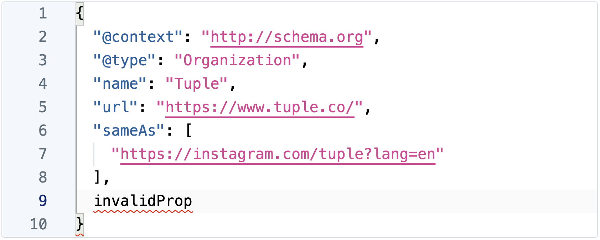

> **Warning**
> 
> This plugin is no longer maintained. We recommend using [Code Field](https://plugins.craftcms.com/codefield) instead.

<h1>
  JSON for Craft CMS
  
</h1>

Field type and helpers for easy JSON editing in Craft CMS 3.

## Features

✅ Advanced JSON editor based on [VS Code](https://code.visualstudio.com/)

✅ Validates JSON

✅ Optionally, prettifies messy JSON

✅ GraphQL support

✅ Includes a `@jsonDecode` directive for GraphQL

Brought to you by [Augmentations](https://github.com/augmentations)
